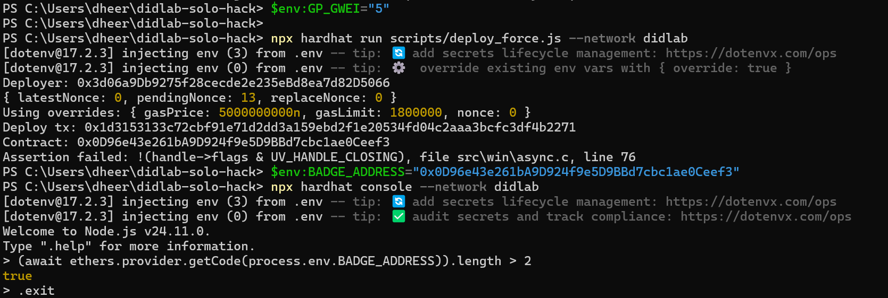
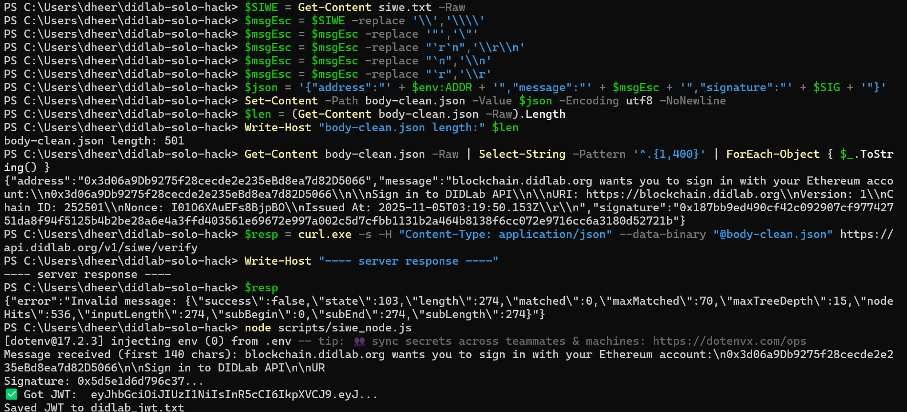
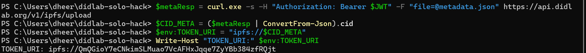
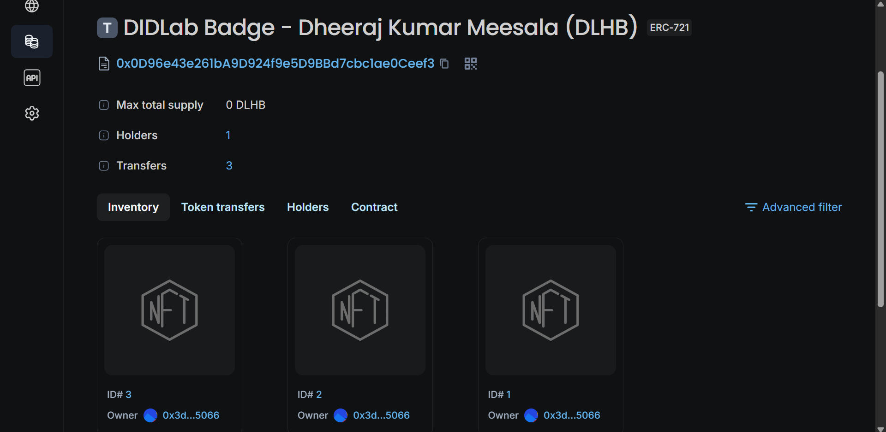

# 🎓 DIDLab Solo Hack — Badge Deployment Report  
**Author:** Dheeraj Kumar Meesala  
**Date:** November 5, 2025  

---

## 🧾 Project Overview
This report documents the successful deployment and minting of my **DIDLab Badge** smart contract on the DIDLab test network.  
The project flow included contract compilation, deployment, authentication via SIWE (Sign-In With Ethereum), IPFS integration for badge metadata, and minting verification on the DIDLab Explorer.

---

## ⚙️ Technical Details

| Parameter | Value |
|------------|-------|
| **Network Name** | DIDLab Test Network |
| **Chain ID** | `252501` |
| **Deployed Contract** | `0x0D96e43e261bA9D924f9e5D9BBd7cbc1ae0Ceef3` |
| **Contract Name** | `DidLabBadgeDheeraj` |
| **Token Name** | *DIDLab Badge – Dheeraj Kumar Meesala (DLHB)* |
| **Token Symbol** | `DLHB` |
| **Contract Type** | ERC-721 (NFT) |
| **Owner Address** | `0x3d06a9Db9275f28cecde2e235eBd8ea7d82D5066` |
| **Tokens Minted** | ID #1, #2, #3 |
| **Mint Tx Hash** | 0x86cf496446c92972f8f9ffc39832b9822df72860f71b53a343abb8b1a34d951b|
| **Holders** | 1 (self) |
| **Transfers Recorded** | 3 |
| **Token URI (IPFS)** | `ipfs://QmQGioY7eCNkimSLMuao7VcAFHxJqqe7ZyYBb384zfRQjt` |
| **JWT Auth (SIWE)** | Successfully verified via `scripts/siwe_node.js` |
| **IMAGE CID** | QmTRnHZVc55zyZinp77sojswmDGSjeVw7XWKmK8ivRUEHR |

---

## 🔗 Verification on DIDLab Explorer
**Contract Explorer URL:**  
👉 [https://explorer.didlab.org/token/0x0D96e43e261bA9D924f9e5D9BBd7cbc1ae0Ceef3](https://explorer.didlab.org/token/0x0D96e43e261bA9D924f9e5D9BBd7cbc1ae0Ceef3)

**Explorer Summary:**
- Contract verified and visible on DIDLab Explorer  
- 3 NFT tokens minted (`ID# 1`, `2`, and `3`)  
- Holder address: `0x3d06a9Db9275f28cecde2e235eBd8ea7d82D5066`  
- Total Transfers: 3  

---

## 🧩 Workflow Summary

### 1️⃣ Contract Deployment
The smart contract `DidLabBadgeDheeraj.sol` was compiled and deployed using Hardhat on the DIDLab network (chainId 252501).

**Screenshot:**  

---

### 2️⃣ SIWE Authentication
A Sign-In With Ethereum (SIWE) message was generated and signed for secure login to the DIDLab API.

**Screenshot:**  

---

### 3️⃣ JWT Token Verification
After signing the message, a JWT token was successfully issued for authenticated API interaction.

**Screenshot:**  

---

### 4️⃣ Metadata and Token URI Setup
The badge image and metadata were uploaded to IPFS to generate a decentralized token URI.

**Screenshots:**  
- **Metadata:**  
  
  

- **Token URI:**  
  

---

### 5️⃣ NFT Minting on DIDLab
The NFT badge was successfully minted via `mintTo()` and verified on the DIDLab Explorer.  
All tokens (#1, #2, #3) are owned by my address.

**Screenshot:**  

---

## Reflection
SIWE authentication and the Hardhat deployment pipeline worked smoothly once I locked in the correct RPC endpoint and toolbox version. IPFS uploads through the DIDLab gateway were reliable and the on-chain metadata resolved immediately in wallets. The biggest friction came from slow block times—several mint attempts piled up in the mempool until I replaced them with higher-gas transactions.

---

**Prepared by:**  
👤 *Dheeraj Kumar Meesala*  
📅 *November 4, 2025*  
🏷️ *DIDLab Solo Hack – Badge Completion Report*
